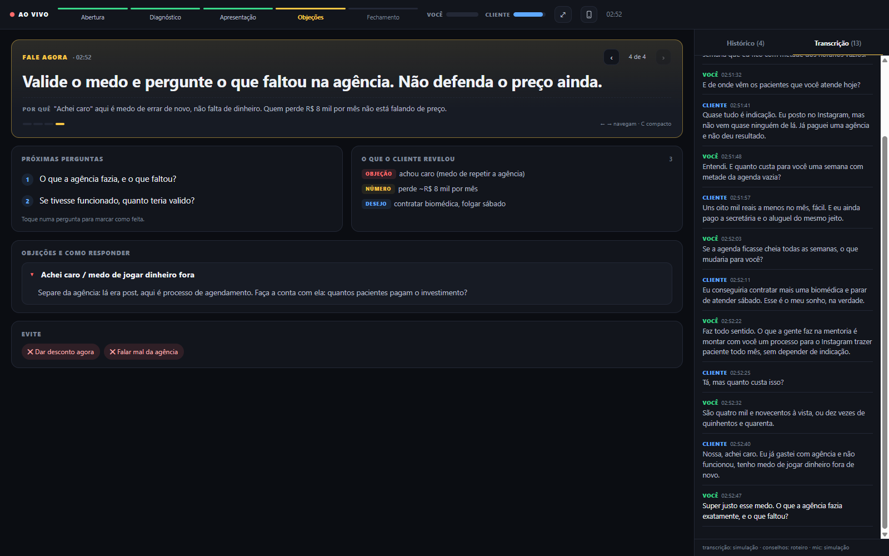

# Copiloto de Reunião

**Um assistente que escuta a sua call de venda ou mentoria e te diz, ao vivo, o que falar agora.**

Ele ouve os dois lados da conversa (o seu microfone e o áudio do cliente que sai do computador), transcreve em tempo real e mostra num painel:

- **Fale agora:** a próxima frase ou pergunta, com o motivo.
- **Próximas perguntas:** para aprofundar o diagnóstico.
- **O que o cliente revelou:** dores, números, desejos e quem decide.
- **Objeções e como responder:** "tá caro", "vou pensar", "preciso falar com meu sócio".
- **Evite:** as armadilhas do momento.

No final, `/reuniao-fim` gera um **resumo** com:
- tarefas com dono e prazo;
- objeções com status;
- proporção de fala (você × cliente);
- **mensagem de follow-up pronta** para mandar no WhatsApp.

Funciona com **Google Meet, Zoom, Teams** e qualquer outro app, sem colocar robô na reunião. Roda dentro do **Claude Code**, em português do Brasil.



## Instalar em 1 minuto

Abra o Claude Code e cole:

```
Instala pra mim o Copiloto de Reunião: https://github.com/marcusforti/copiloto-reuniao
Siga o arquivo INSTALAR.md do repositório.
```

Ou na mão:

```
/plugin marketplace add marcusforti/copiloto-reuniao
/plugin install copiloto-reuniao@copiloto-reuniao
/reuniao-instalar
```

## Dois caminhos: grátis e pago

| | **Grátis** | **Pago** |
|---|---|---|
| Transcrição | No seu PC (Whisper). Nada sai do computador. | Deepgram ou Soniox, em tempo real |
| Atraso | 2 a 5 segundos | menos de 1 segundo |
| Peso no PC | ~1 GB de memória, usa o processador | quase nada |
| Custo | R$ 0 | Deepgram: US$ 200 grátis na conta nova, depois ~US$ 0,30/h por canal. Soniox: ~US$ 0,12/h por canal |
| Conselhos | Claude Code (o seu plano) | Claude Code, ou API da Anthropic (opcional, independente do Claude Code) |

Trocar de caminho é uma linha: `copiloto config transcricao deepgram` (ou `local`).

## Como usar

```
/reuniao-teste                                       testa microfone e áudio do PC
/reuniao venda Camila mentoria de 90 dias, R$ 4.900  liga o copiloto antes da call
/reuniao mentoria João                               modo mentoria
/reuniao-fim                                         encerra e gera o resumo + follow-up
/reuniao-demo                                        mostra funcionando numa venda simulada
```

Modos: **venda**, **mentoria**, **diagnostico**, **geral**. Cada um tem o seu roteiro (`skills/copiloto-reuniao/modos/`), e dá para editar com o seu método.

O painel abre no navegador. O botão 📱 mostra um QR code para abrir **no celular**, como segunda tela: assim, se você compartilhar a tela, o cliente não vê nada.

## Como funciona

```
 Microfone (você) ─┐                              ┌─► transcricao.jsonl ─► Claude Code (Monitor) ─► conselhos.json ─┐
                   ├─► motor (processo próprio) ──┤                                                               ├─► painel (PC e celular)
 Áudio do PC ──────┘   VAD + Whisper ou API       └─► estado.json (medidores, alertas) ──────────────────────────────┘
 (voz do cliente)
```

- **Motor independente:** a gravação roda num processo próprio. Ela não morre se a sessão do Claude Code cair nem no limite de 2 h de tarefas em segundo plano.
- **Ouve o dispositivo certo:** usa o microfone de comunicação do Windows (o mesmo do Meet, Zoom e Teams) e escuta **todas** as saídas de áudio. Se o fone Bluetooth trocar de modo no meio da call, a voz do cliente continua chegando. Também reconecta sozinho quando você pluga ou tira um fone.
- **Avisa quando algo está errado:** "Não estou ouvindo VOCÊ há 1 minuto" aparece em vermelho no painel.
- **Corta a fala pela pausa (VAD Silero)**, e não em blocos fixos. Assim não corta palavra no meio e responde mais rápido.
- **Filtra as alucinações** do Whisper ("legendas pela comunidade Amara.org", "Quem? Quem? Quem?") e o eco de quem usa caixa de som.
- **Gasta pouca memória:** o Whisper roda sem o Intel MKL. Com ele, o processo reservava mais de 2 GB e derrubava a transcrição com o navegador aberto. Sem ele, cai para ~300 MB, na mesma velocidade.

O projeto nasceu de uma call real. Na primeira versão, a transcrição caiu por falta de memória, a voz do vendedor sumiu depois de trocar de fone e tudo parou com 2 horas. Esta versão foi reescrita para resolver exatamente esses três problemas.

## Privacidade (LGPD)

- **Avise no começo da reunião** que a conversa está sendo transcrita. Uma frase basta: *"vou usar um assistente que anota a nossa conversa, tudo bem?"*
- **No modo grátis o áudio não sai do seu computador.** No modo pago, o áudio vai para o provedor de transcrição que você escolheu.
- As transcrições ficam em `~/CopilotoReuniao/sessoes/`, só no seu PC.
- O copiloto não registra dados sensíveis (saúde, família, religião) nos conselhos nem no resumo.

## Problemas comuns

| Sintoma | Solução |
|---|---|
| "Não estou ouvindo VOCÊ" | O app da reunião usa outro microfone. No Windows: Configurações > Som > definir o microfone como **padrão de comunicação**. Rode `/reuniao-teste`. |
| "Não estou ouvindo o CLIENTE" | No Mac: falta o BlackHole + Multi-Output (`instalar/instalar-mac.sh`). No Windows: confira se o som da reunião está saindo pelo PC. |
| Atraso grande | Feche abas pesadas, ou use o modo pago. |
| Painel não abre no celular | Celular e PC precisam estar na mesma Wi-Fi. Permita o Python no firewall do Windows quando ele perguntar. |

## Testar sem reunião

```
python motor/copiloto.py simular exemplos/demo-venda.json            # painel com uma venda simulada
python motor/copiloto.py simular exemplos/demo-venda.json --audio    # passa voz sintetizada pelo pipeline real e mede a precisão
```

No nosso teste (i7 de 4 núcleos, modo grátis), a transcrição bateu **94% a 96%** com o roteiro, sem atraso acumulado.

## Licença

MIT. Feito por [Marcus Forti](https://github.com/marcusforti). Gostou? Me chama no [WhatsApp](https://wa.me/5515998346245?text=Oi%20Marcus%2C%20vim%20pelo%20Copiloto%20de%20Reuni%C3%A3o).
